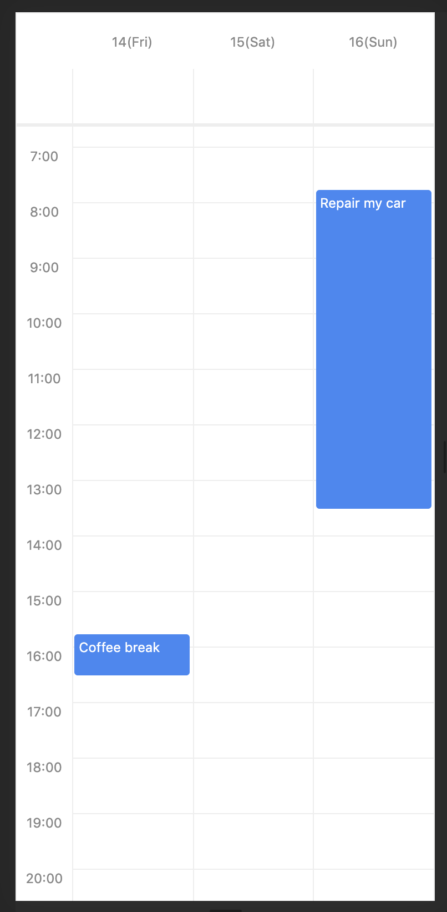

[](https://badge.fury.io/js/react-native-big-calendar)
[](https://app.netlify.com/sites/react-native-big-calendar/deploys)

**We use `Readme-Driven Development` so some part of features in this document has not been implemented yet.**

# react-native-big-calendar

Cross-platform gcal/outlook like calendar component for React Native.

[Components Demo](https://react-native-big-calendar.netlify.com/?path=/story/desktop--3days-mode)



# Features

- Cross Platform: Runs on Web, iOS, Android with the power of React
- Type-safe: Fully written in TypeScript
- Customizable: Adjust styles of components
- Lightweight: ~10kb, only one dependency is `dayjs`

# Install

```
npm install --save react-native-big-calendar
```

Or if you use Yarn:

```
yarn add react-native-big-calendar
```

# Getting Started

```typescript
import { Calendar } from 'react-native-big-calendar'

const events = [
  {
    title: 'Meeting',
    start: new Date(2020, 1, 11, 10, 0),
    end: new Date(2020, 1, 11, 10, 30),
  },
  {
    title: 'Coffee break',
    start: new Date(2020, 1, 11, 15, 45),
    end: new Date(2020, 1, 11, 16, 30),
  },
]

function App() {
  return <Calendar events={events} height={600} />
}
```

# API

`<Calendar />` component

| props               | required | type                                             | description                                                                                                                              |
| ------------------- | -------- | ------------------------------------------------ | ---------------------------------------------------------------------------------------------------------------------------------------- |
| height              | yes      | `number`                                         | The height of calendar.                                                                                                                  |
| events              | yes      | `Array<{title: string, start: Date, end: Date}>` | Events which will be rendered in the calendar.                                                                                           |
| mode                | yes      | `'3day' \| 'week'`                               | The type of the calendar.                                                                                                                |
| onPressEvent        |          | `(event: Event) => void`                         | The handler which fire on press an event.                                                                                                |
| style               |          | `ViewStyle`                                      | The style of the calendar.                                                                                                               |
| eventCellStyle      |          | `ViewStyle \| (event: Event) => ViewStyle`       | The style of event cells.                                                                                                                |
| scrollOffsetMinutes |          | `number`                                         | The minutes of vertical scroll offset of the calendar. e.g.) if you want to show the calendar 8:00am by default, set this value to `480` |
