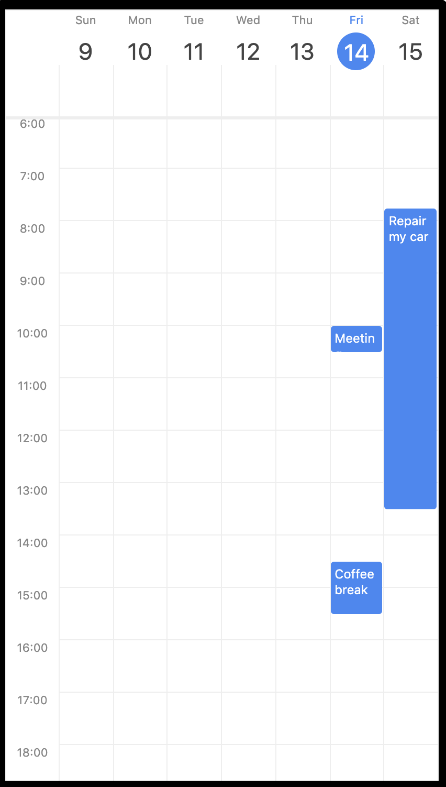
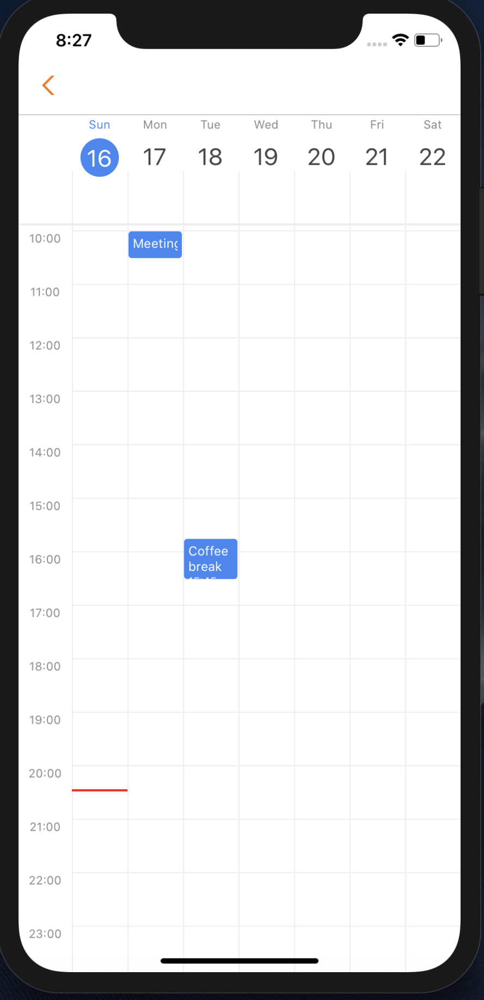
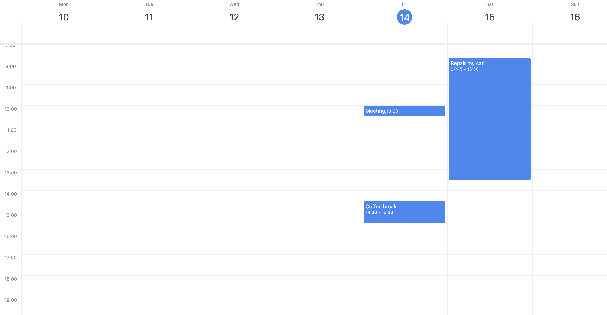

[](https://badge.fury.io/js/react-native-big-calendar)
[](https://app.netlify.com/sites/react-native-big-calendar/deploys)
[](https://dependabot.com)

# react-native-big-calendar

Cross-platform gcal/outlook like calendar component for React Native.

[Components Demo](https://react-native-big-calendar.netlify.com/?path=/story/desktop--3days-mode)



# Features

- Cross Platform: Runs on the Web, iOS, Android with the power of React
- Type-safe: Fully written in TypeScript
- Customizable: Adjust styles of components
- Lightweight: ~15kb, only one dependency is `dayjs`

# Install

```
npm install --save react-native-big-calendar
```

Or if you use Yarn:

```
yarn add react-native-big-calendar
```

# Getting Started

```typescript
import { Calendar } from 'react-native-big-calendar'

const events = [
  {
    title: 'Meeting',
    start: new Date(2020, 1, 11, 10, 0),
    end: new Date(2020, 1, 11, 10, 30),
  },
  {
    title: 'Coffee break',
    start: new Date(2020, 1, 11, 15, 45),
    end: new Date(2020, 1, 11, 16, 30),
  },
]

function App() {
  return <Calendar events={events} height={600} />
}
```

# API Documentation

**Summary**

```typescript
interface CalendarProps<T = {}> {
  events: Event<T>[]
  height: number
  hideNowIndicator?: boolean
  mode?: Mode
  style?: ViewStyle
  eventCellStyle?: EventCellStyle<T>
  scrollOffsetMinutes?: number
  date?: Date
  swipeEnabled?: boolean
  showTime?: boolean
  weekStartsOn?: WeekNum
  locale?: string
  overlapOffset?: number
  isRTL: boolean
  onChangeDate?: ([start, end]: [Date, Date]) => void
  onPressEvent?: (event: Event<T>) => void
  onPressDateHeader?: (date: Date) => void
}
```

`<Calendar />` Props are:

| name                  | required | type                                                                                | description                                                                                                                                                                                                          |
| --------------------- | -------- | ----------------------------------------------------------------------------------- | -------------------------------------------------------------------------------------------------------------------------------------------------------------------------------------------------------------------- |
| `events`              | yes      | `Array<{ title: string, start: Date, end: Date, children?: React.ReactNode }>`      | The events which will be rendered on the calendar, with optional children to display custom components on the event. Events that occur during the same time range will be layered, offset, and given a unique color. |
| `height`              | yes      | `number`                                                                            | Calendar height.                                                                                                                                                                                                     |
| `hideNowIndicator`    | no       | `boolean`                                                                           | Hides the indicator for the current time. By default the now indicator is shown.                                                                                                                                     |
| `onPressEvent`        | no       | `(event: { title: string, start: Date, end: Date } => void)`                        | Event handler which will be fired when the user clicks an event.                                                                                                                                                     |
| `onChangeDate`        | no       | `([start, end]: [Date, Date]) => void`                                              | Event handler which will be fired when the current date range changed.                                                                                                                                               |
| `onPressCell`         | no       | `(date: Date) => void`                                                              | Event handler which will be fired when the current date cell is clicked. The minute set to 0.                                                                                                                        |
| `onPressDateHeader`   | no       | `(date: Date) => void`                                                              | Event handler which will be fired when the user clicks a date from the header.                                                                                                                                       |
| `mode`                | no       | `3days`, `week`, `day`                                                              |                                                                                                                                                                                                                      |
| `style`               | no       | `import('react-native').ViewStyle`                                                  |                                                                                                                                                                                                                      |
| `eventCellStyle`      | no       | `ViewStyle` or `((event: { title: string, start: Date, end: Date } ) => ViewStyle)` | The style of Event cell. Accepts either style object (static) or function (dynamic).                                                                                                                                 |
| `scrollOffsetMinutes` | no       | `number`                                                                            | Scroll to specific minutes in a day. e.g.) set `480` to scroll to 8am when the calendar rendered.                                                                                                                    |
| `date`                | no       | `Date`                                                                              | Initial date. Defualts to `Date`                                                                                                                                                                                     |
| `swipeEnabled`        | no       | `boolean`                                                                           |                                                                                                                                                                                                                      |
| `showTime`            | no       | `boolean`                                                                           |                                                                                                                                                                                                                      |
| `ampm`                | no       | `boolean`                                                                           | Use 12 hours time format instead of 24 hours.                                                                                                                                                                        |
| `weekStartsOn`        | no       | 0, 1, 2, 3, 4, 5, 6                                                                 | Which day the week starts on. Sunday is `0`.                                                                                                                                                                         |
| `locale`              | no       | `string`                                                                            | Custom locale. See I18n section                                                                                                                                                                                      |
| `overlapOffset`       | no       | `number`                                                                            | Adjusts the indentation of events that occur during the same time period. Defaults to 20 on web and 8 on mobile.                                                                                                     |
| `isRTL`               | no       | `boolean`                                                                           | Switches the direction of the layout for use with RTL languages. Defaults to false.                                                                                                                                  |

For more information, see [Storybook](https://github.com/llotheo/react-native-big-calendar/blob/master/stories/index.stories.tsx)

# I18n

Please specity your locale via `locale` prop **and** import day.js locale file:

```typescript
import 'dayjs/locale/ja'

<Calendar
  locale="ja"
  {/* ... */}
/>
```

You can find your dayjs locale here:

https://github.com/iamkun/dayjs/tree/dev/src/locale

# Screenshots





# Who's using this?

<a href="https://www.nupp1.io?utm_source=react-native-big-calendar">
  
</a>

If you are using this library, please send a PR to add your organization!

# TODO

- [x] Add API Documentation
- [x] Add `onClickCell` feature
- [ ] Add `onDrugCell` feature
- [ ] Style customize
  - [ ] Blue active day
  - [ ] Blue active day text
  - [ ] Today indicator
- [ ] Support the month view layout
